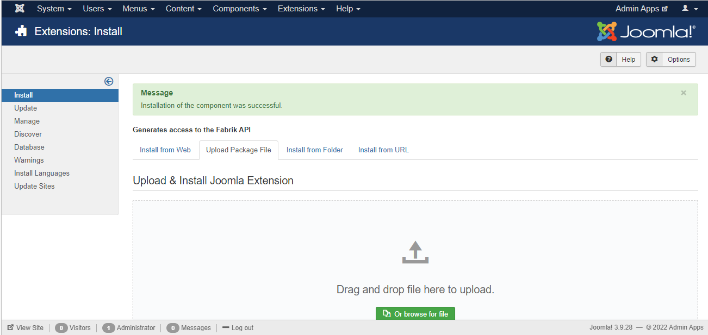
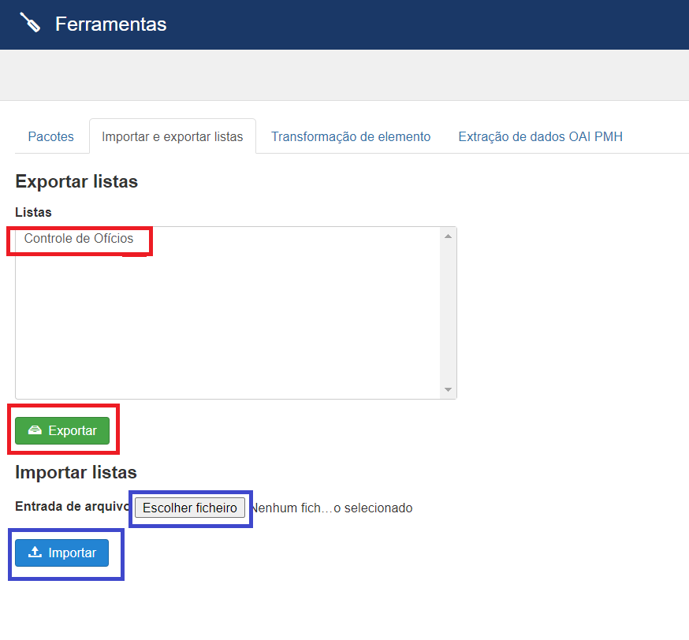

<h1 style="text-align: center"> Ferramentas Administrativas </h1>

É um componente joomla para uso pelo Fabrik, que tem várias guias cada uma com as suas funções:

<ol>
<li><strong>Pacotes</strong></li>
<li><strong>Importar e exportar listas</strong></li>
<li><strong>Transformação de elementos</strong></li>
<li><strong>Extração de dados OAI PMH</strong></li>
<li><strong>Mudar lista</strong></li>

Ferramenta que muda/altera/renomeia o nome da tabela/lista do fabrik e as suas relações criadas
com as imagens e joins com algumas seguranças:

<ul>
<li>Faça o backup do banco de dados antes por segurança.</li>
<li>Coloque o site em manutenção/fora do ar.</li>
</ul> 

Seguindo estas instruções não vão ter problema com as alterações.

<li><strong>Sincronizar lista</strong></li>

Ferramenta que sincroniza tabelas com base em outro sistema de desenvolvimento, atualizando tanto tabelas de modelos dos dados quanto tabelas de dados.

</ol>

<h2>Instalação</h2>

Para isso, em sua tela de administrador do Joomla vá em Extensions->Manage->Install e clique na aba Upload Package File como na imagem abaixo.

Após isso, basta navegar ao arquivos .zip e arrastar para a caixa de seleção, se ocorrer tudo como esperado na instalação o resultado deve ser o seguinte.

<h2>Utilização</h2>

<h3>Pacote</h3>
Pode ser gerado um pacote com tabelas selecionadas e fazer upload de arquivo que será adicionado ao pacote.

<h3>Importar e Exportar Lista</h3>
Listas do fabrik podem ser exportadas, juntamente com todos os elementos, formulários, grupos, plugins e configurações personalizadas.
<li>Para exportar deve selecionar uma ou mais listas e clicar em exportar, onde será gerado um arquivo json, que poderá ser importado por outro site.</li>
<li>Para importar deve selecionar o arquivo json gerado em entrada de arquivos e clicar em importar.</li>

<h3>Transformação de Elemento</h3>
Transforma o tipo de elemento. 

<li>Deve-se selecionar a lista, elemento de origem e o tipo de transformação</li>

<h3>Extração de dados OAI PMH</h3>
Funcionalidade para coletar os registros de repositórios institucionais e bibliotecas digitais.
Alguns repositórios online expõem seus metadados por meio do OAI-PMH. Este plugin possibilita coletar esses metadados, mapeando-os para o modelo de dados Omeka. O plug-in pode ser usado para transferências de dados únicas ou para manter-se atualizado com as alterações em um repositório online.

Atualmente, o plugin é capaz de importar metadados Dublin Core , CDWA Lite e METS . Dublin Core é um padrão reconhecido internacionalmente para descrever qualquer recurso.

© Universidade Federal de Goiás — UFG. Todos os direitos reservados.

