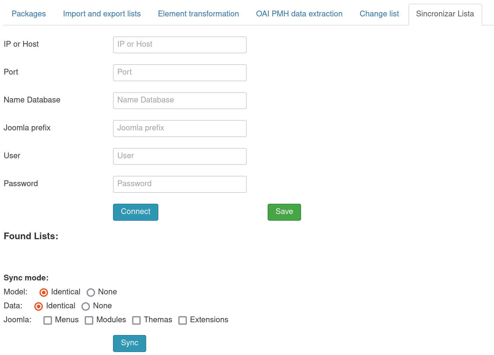

# Administrative tools 

It is a joomla component for use by Fabrik, which has several tabs each with their functions:

## Contens
  - [Installation](#installation)
  - [Packages](#packages)
  - [Import and Export Lists](#import-and-export-list)
  - [Transformation of Elements](#transformation-of-elements)
  - [OAI PMH Data Extraction](#oai-pmh-data-extraction)
  - [Sincronizar lista](#sincronizar-lista)
      
      Tool that synchronizes tables based on another development system, updating both data model tables and data tables.
  - [Change list](#change-list)
      
     

  Following these instructions will have no problem with the changes.

### Installation
To do so, in your Joomla admin screen, go to Extensions->Manage->Install and click on the Upload Package File tab as in the image below.

After that, just browse the .zip files and drag them to the selection box, if everything happens as expected in the installation, the result should be the following.

### Package
A package with selected tables can be generated and a file uploaded that will be added to the package.

### Import and Export List
Fabrik lists can be exported, along with all elements, forms, groups, plugins and custom settings.
- To export you must select one or more lists and click on export, where a json file will be generated, which can be imported by another site.
- To import you must select the generated json file in file input and click on import.

### Element Transformation
Transforms the element type.
- You must select the list, source element and type of transformation

### OAI PMH Data Extraction
Functionality to collect records from institutional repositories and digital libraries.
Some online repositories expose their metadata through the OAI-PMH. This plugin makes it possible to collect this metadata, mapping it to the Omeka data model. The plugin can be used for one-time data transfers or to keep up to date with changes in an online repository.
Currently, the plugin is capable of importing Dublin Core, CDWA Lite and METS metadata. Dublin Core is an internationally recognized standard for describing any resource.

### Change list

 Tool that changes/changes/renames the name of the fabrik table/list and its created relationships
with the images and joins with some security:

- Back up the database first for safety.
- Put the site down/maintenance down.

### Sincronizar Lista

The functionality of synchronizing the list aims to update the database model and its data based on another development environment, 
thus enabling a more agile update between the production and development environments. For this, the sync lists, as shown below, 
need some parameters from the search database to carry out the update based on it, that is, the fields of IP, Port, Bank name, 
Prefix, User and Password are extremely important for the correct functioning of the functionality.

In addition, as seen above, there is also space to select the synchronization mode that are divided between:

1.**Model**:

The Model synchronization mode will only synchronize the database tables that the most important is the data model and not the data itself, it means that the model tables are the tables added and managed by the fabrik lists, in this way, this function works by selecting data from all template tables of the joomla_fabrik_lists table and pulling their data templates to the local database, such as added columns (created elements), reapet tables (databasejoin elements), change in column type (change of element), among other cases.

- Identical - Will perform the above function on all found lists and update with any changes found.

- None - Will not perform the above function on any list found, i.e. will not update the data model on any changes found.
    
2.**Data**:

The Data synchronization mode will synchronize the data referring to the main joomla tables, such as #__fabrik_lists, #__fabrik_forms, #__fabrik_groups, among others, so that with the data model updated in the previous step, the fabrik core will also be kept up to date, this way, the fabrik data model remains unchanged but its table data will update with elements created, creation of lists, alteration of elements, among other things.

- Identical - Will perform the above function on all found lists and update with any changes found.

- None - Will not perform the above function on any list found, i.e. will not update the data model on any changes found.
    
3.**Joomla**:

In addition to the above two synchronization modes, it is also possible to update tables from joomla itself. In the options available today, it is possible to update the menus, modules, themes and extensions tables, thus being able to capture any change in these functionalities. It is important to point out that updating the tables above is only for data and not for the model, that is, changes to columns made directly in the database in them (highly not recommended) will not be updated. In addition, it is important to point out that this functionality does not capture changes to files, only changes to the database, that is, if a new extension is installed, the table referring to it will be updated with an extra line with the installed extension, but it will not will in fact be installed on the system as the files for it are missing, that said, it is recommended to update files via GitHub.
