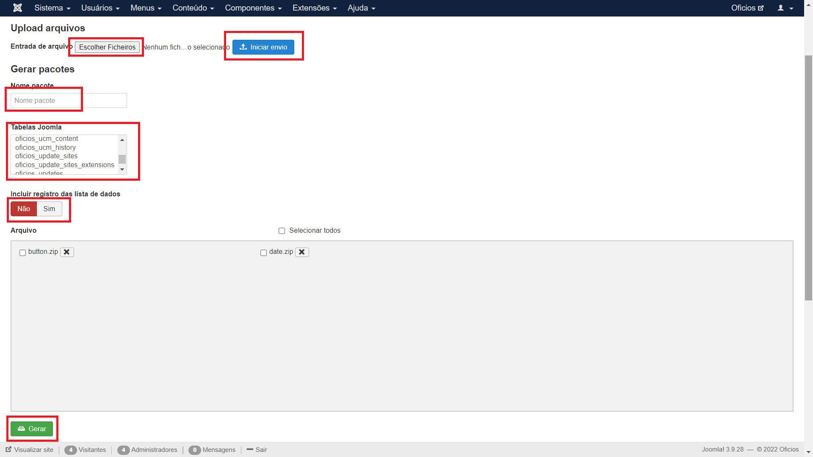
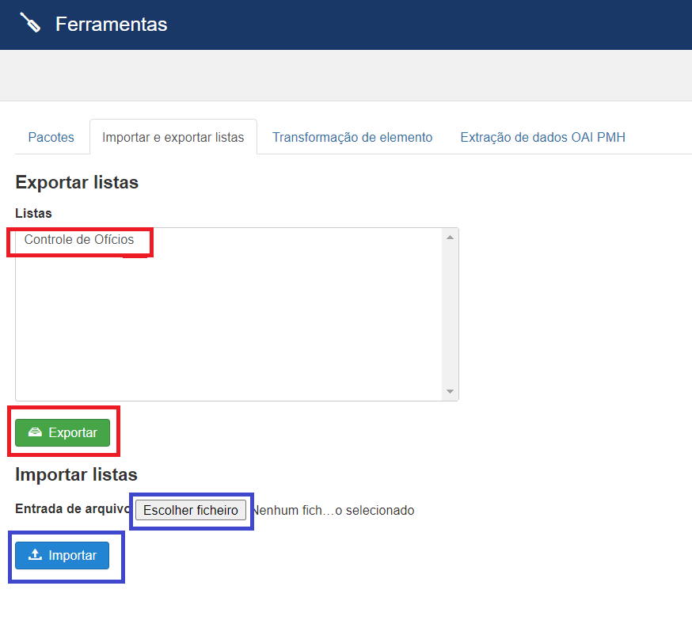
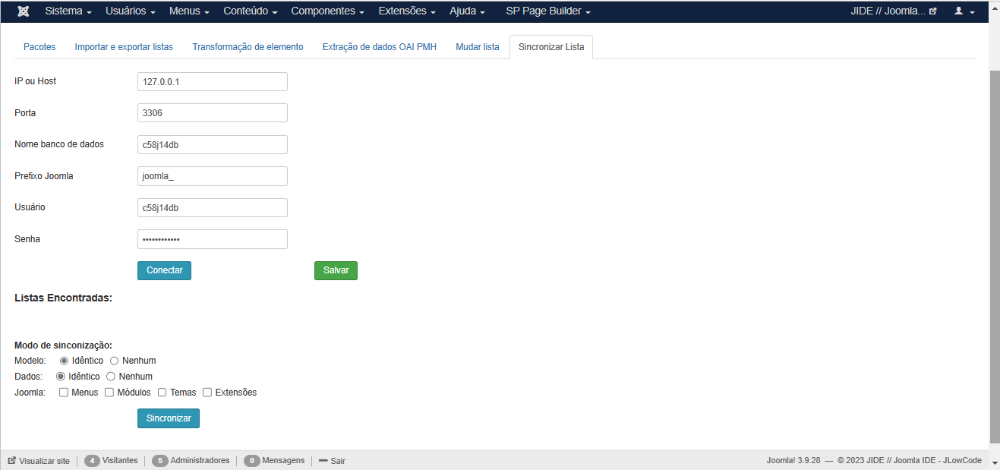
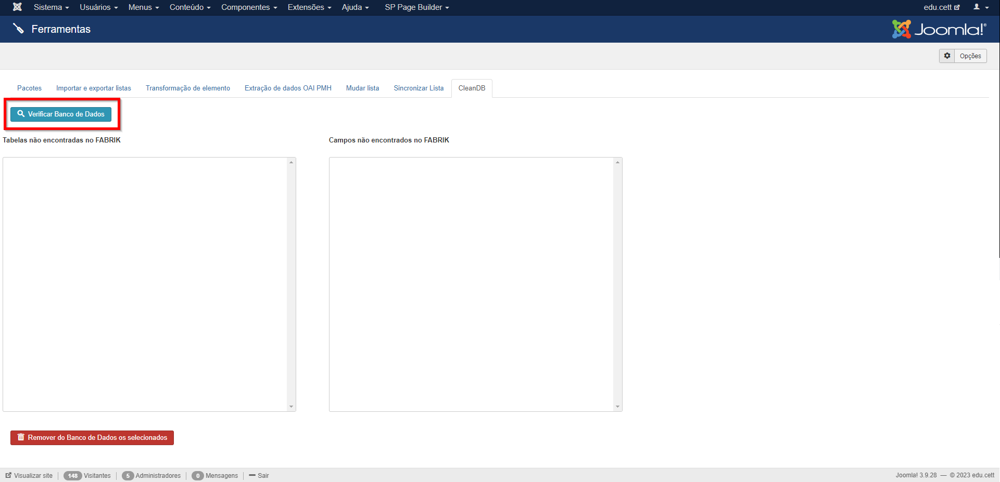
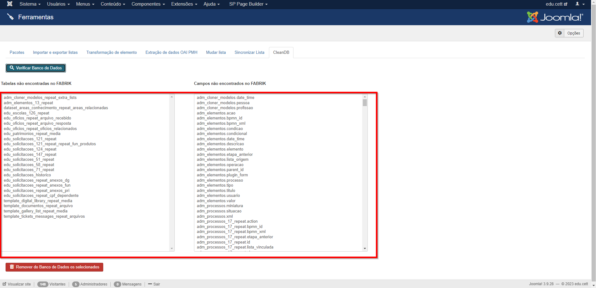
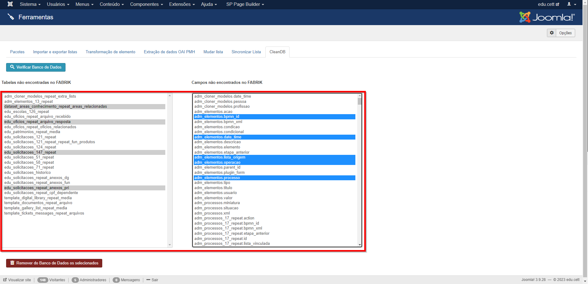
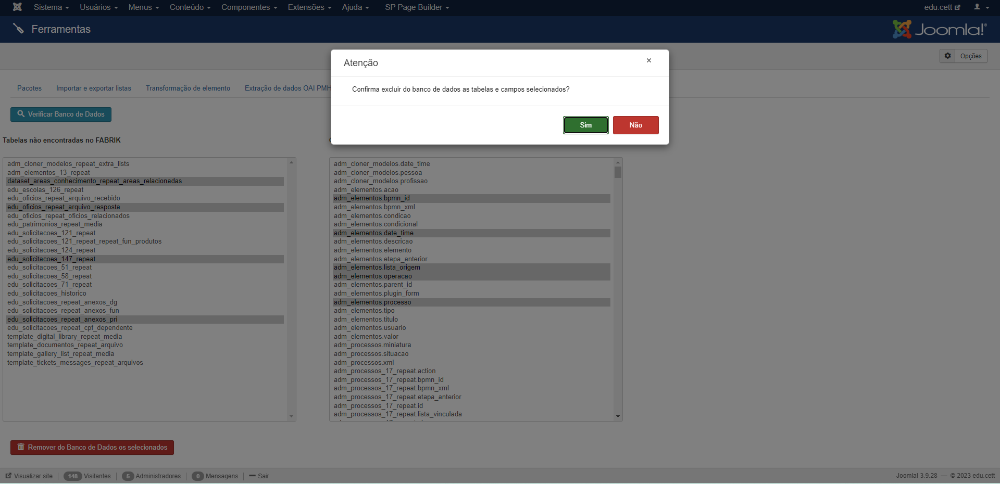
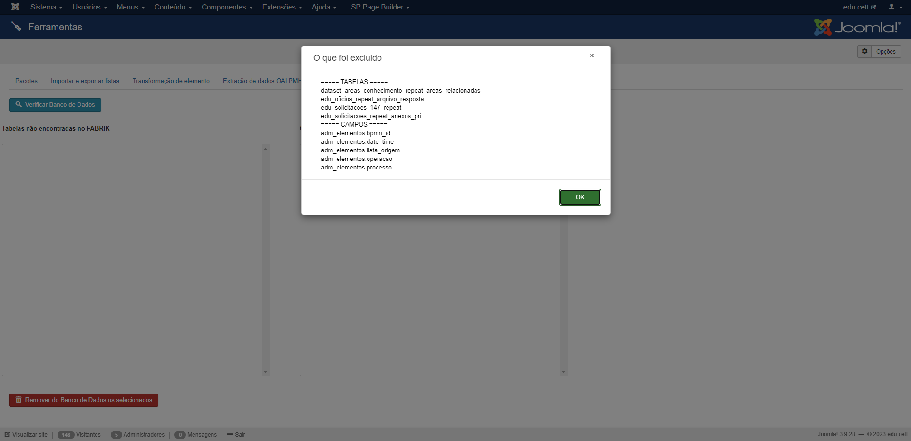

<h1 style="text-align: center"> Ferramentas Administrativas </h1>

    É um componente joomla para uso pelo Fabrik, que tem várias guias cada uma com as suas funções:

<ol>
    <li><strong>Pacotes</strong></li>
    <li><strong>Importar e exportar listas</strong></li>
    <li><strong>Transformação de elementos</strong></li>
    <li><strong>Extração de dados OAI PMH</strong></li>
    <li><strong>Mudar lista</strong></li>
    

        Ferramenta que muda/altera/renomeia o nome da tabela/lista do fabrik e as suas relações criadas
        com as imagens e joins com algumas seguranças:
    

    <ul>
        <li>Faça o backup do banco de dados antes por segurança.</li>
        <li>Coloque o site em manutenção/fora do ar.</li>
    </ul> 
    

        Seguindo estas instruções não vão ter problema com as alterações.
    

    <li><strong>Sincronizar lista</strong></li>
    

        Ferramenta que sincroniza tabelas com base em outro sistema de desenvolvimento, atualizando tanto tabelas de
        modelos dos dados quanto tabelas de dados.
    

    <li><strong>CleanDB</strong></li>
</ol>

<h2>Instalação</h2>

Para isso, em sua tela de administrador do Joomla vá em Extensions->Manage->Install e clique na aba Upload Package
    File como na imagem abaixo.

Após isso, basta navegar ao arquivos .zip e arrastar para a caixa de seleção, se ocorrer tudo como esperado na
instalação o resultado deve ser o seguinte.

<h2>Utilização</h2>

<h3>Pacote</h3>
Pode ser gerado um pacote com tabelas selecionadas e fazer upload de arquivo que será adicionado ao pacote.

<h3>Importar e Exportar Lista</h3>
Listas do fabrik podem ser exportadas, juntamente com todos os elementos, formulários, grupos, plugins e configurações
personalizadas.
<li>Para exportar deve selecionar uma ou mais listas e clicar em exportar, onde será gerado um arquivo json, que poderá
    ser importado por outro site.</li>
<li>Para importar deve selecionar o arquivo json gerado em entrada de arquivos e clicar em importar.</li>

<h3>Transformação de Elemento</h3>
Transforma o tipo de elemento.

<li>Deve-se selecionar a lista, elemento de origem e o tipo de transformação</li>

<h3>Extração de dados OAI PMH</h3>
Funcionalidade para coletar os registros de repositórios institucionais e bibliotecas digitais.
Alguns repositórios online expõem seus metadados por meio do OAI-PMH. Este plugin possibilita coletar esses metadados,
mapeando-os para o modelo de dados Omeka. O plug-in pode ser usado para transferências de dados únicas ou para manter-se
atualizado com as alterações em um repositório online.

Atualmente, o plugin é capaz de importar metadados Dublin Core , CDWA Lite e METS . Dublin Core é um padrão reconhecido
internacionalmente para descrever qualquer recurso.

<h3>Sincronização de listas</h3>

A funcionalidade de sincronizar lista tem o objetivo de realizar a atualização do modelo
    de dados do banco e de seus dados com base em outro ambiente de desenvolvimento, dessa forma, possibilitando uma
    atualização mais ágil entre ambiente de produção e de desenvolvimento. Para isso, o sync lists, como mostrado
    abaixo, necessita de alguns parâmetros do banco de dados de busca para que realize a atualização com base nele, ou
    seja, os campos de IP, Porta, Nome do banco, Prefixo, Usuário e Senha são de extrema importância para o
    funcionamento correto da funcionalidade.

Além disso, como visto acima há também o espaço para selecionar o modo de sincronização
    que se dividem entre:

    <li><strong>Modelo</strong></li>
    
O modo de sincronização de Modelo irá sincronizar apenas as tabelas do banco de dados
        que o mais importante é o modelo dos dados e não os próprios dados, isso significa que as tabelas modelos são as
        tabelas adicionadas e gerenciadas pelo fabrik lists, dessa forma, esta função funciona selecionando os dados de
        todas as tabelas modelos da tabela joomla_fabrik_lists e puxando para o banco local os modelos de dados delas,
        como por exemplo, colunas adicionadas (elementos criados), tabelas reapet (elementos databasejoin), alteração no
        tipo da coluna (mudança de elemento), entre outros casos.

    <ul>
        <li>
            
Idêntico - Exercerá a função acima em todas as listas encontradas e
                atualizará com todas as alterações encontradas.

        </li>
        <li>
            
Nenhum - Não exercerá a função acima em nenhuma lista encontrada, ou seja,
                não atualizará o modelo de dados em nenhum alteração encontrada.

        </li>
    </ul>

    <li><strong>Dados</strong></li>
    
O modo de sincronização de Dados irá sincronizar os dados referentes às tabelas
        principais do joomla como, #__fabrik_lists, #__fabrik_forms, #__fabrik_groups, entre outras, para que com o
        modelo de dados atualizado na etapa anterior o core do fabrik também se mantenha atualizado, dessa forma, o
        modelo de dados do fabrik se mantém inalterado mas seus dados da tabelas irão se atualizar com elementos
        criados, criação de listas, alteração de elementos, entre outras coisas.

    <ul>
        <li>
            
Idêntico - Exercerá a função acima em todas as listas encontradas e
                atualizará com todas as alterações encontradas.

        </li>
        <li>
            
Nenhum - Não exercerá a função acima em nenhuma lista encontrada, ou seja,
                não atualizará o modelo de dados em nenhum alteração encontrada.

        </li>
    </ul>

    <li><strong>Joomla</strong></li>
    
Além dos dois modos de sincronização acima, também é possível atualizar tabelas do
        próprio joomla. Nas opções disponíveis hoje é possível atualizar as tabelas dos menus, dos módulos, dos temas e
        das extensões, podendo assim capturar qualquer alteração nessas funcionalidades. É importante ressaltar que a
        atualização das tabelas acima são apenas de dados e não de modelo, ou seja, alteração em colunas feitas
        diretamento no banco nelas (altamente não recomendado) não serão atualizadas. Além disso, é importante ressaltar
        que esta funcionalidade não captura alteração de arquivos apenas alterações em banco de dados, ou seja, caso
        seja instalado uma nova extensão a tabela referente a ela será atualizada com uma linha a mais com a extensão
        instalada, porém ela não estará de fato instalada no sistema pois faltaram os arquivos da mesma, dito isso,
        recomenda-se atualização de arquivos via GitHub.

<h3>CleanDB</h3>

O CleanDB permite mostrar ao desenvolvedor do sistema a relação de listas e elementos que estão no banco de dados e que não são mais utilizadas pelo sistema, 
permitindo que ele, após criteriosa análise, realize a exclusão desses objetos que representam "lixo" no banco de dados.

Ao clicar no botão "Verificar Banco de Dados" será carreagada a relação das Tabelas (quadro esquerdo) e dos Campos (quadro direito) que existem no banco de dados e não são utilizados pelo sistema.

    
    

Selecione os objetos a ser excluidos e clique no botão "Remover do banco de Dados os selecionados".

    

Será apresentada uma tela de confirmação.

    

Ao final da operação será apresentada a relação de tudo o que foi excluído.

    
<b>Tenha certeza do que está fazendo, a operação não permite retorno e os objetos serão excluído do banco de dados definitivamente!</b>
    

    © Universidade Federal de Goiás — UFG. Todos os direitos reservados.

